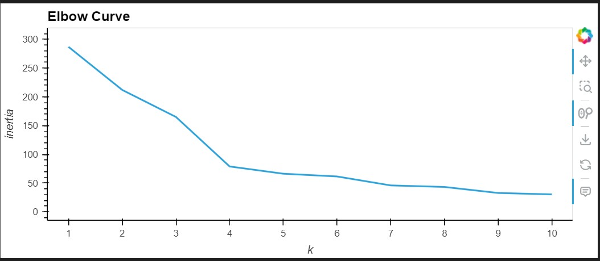
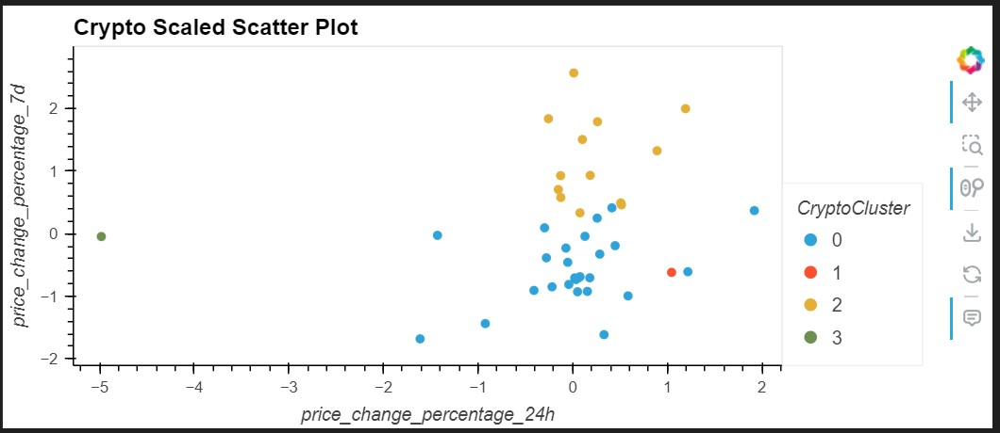
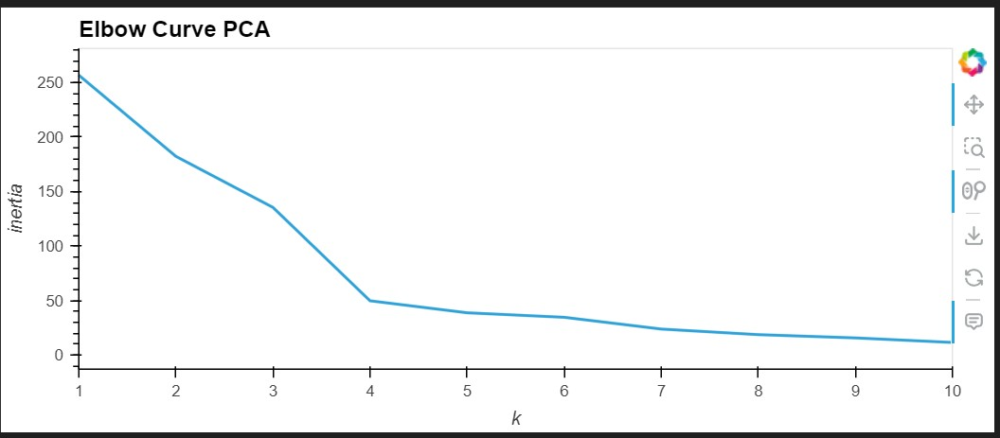
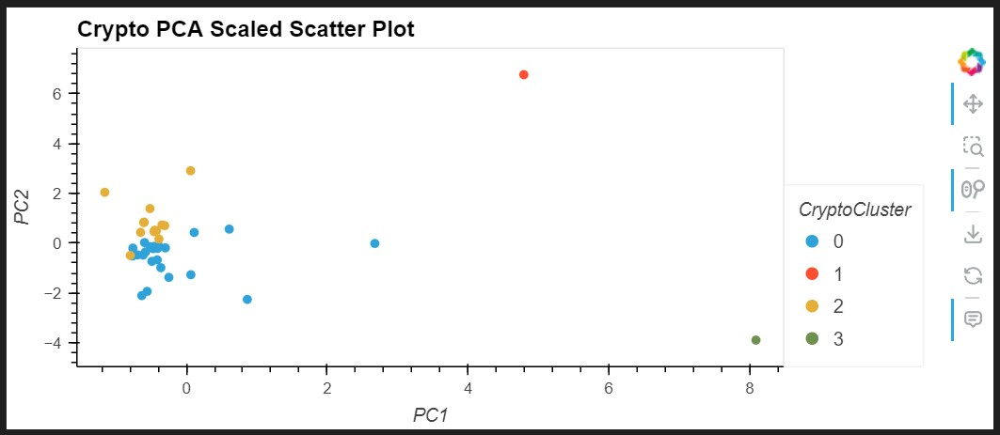

# Crypto Clustering

## Overview

In this challenge, you'll use your knowledge of Python and unsupervised learning to predict if cryptocurrencies are affected by 24-hour or 7-day price changes.

## Steps

1. Load the data into a DataFrame.
2. Prepare the data by scaling it using StandardScaler().
3. Find the best value for k using the Scaled DataFrame.
4. Cluster cryptocurrencies with K-means using the original scaled data.
5. Optimize clusters with Principal Component Analysis (PCA)
6. Find the best value for k using the PCA DataFrame.
7. Cluster cryptocurrencies with K-means using the PCA DataFrame.
8. Visualize and compare the results using hvPlot.

## Results

The project includes the following visualizations:

1. Elbow curve for the original data.

 
2. Scatter plot of cryptocurrency clusters based on the original data.

3. Elbow curve for the PCA data.

4. Scatter plot of cryptocurrency clusters based on the PCA data.

## Conclusion

The project analyzes the impact of using fewer features on clustering the data using K-means. Comparing the clustering results of the original data and the PCA data helps to understand the effect of dimensionality reduction on the clustering process.

## Dependencies

- Python
- pandas
- scikit-learn
- hvPlot
